# Agentic AI SOC Analyst

**A tier-1 analyst can triage more alerts in a day than they can meaningfully investigate.** The bottleneck in most SOCs isn't detection. It's the judgment call about which signals deserve a human's attention, and the hours spent writing queries to answer questions that were obvious the moment they were asked.

This is an agentic threat-hunting assistant that closes part of that gap. An analyst asks a question in plain English. The agent decides which log table holds the answer, builds and validates the KQL, runs the hunt, and returns findings mapped to MITRE ATT&CK with graded confidence and recommended actions. It can isolate a compromised host, but only after a human reads the evidence and types `yes`.

Built against a live Microsoft SOC stack: Azure Log Analytics, Microsoft Defender for Endpoint, and Entra ID sign-in telemetry, with Google Gemini as the reasoning layer.


---

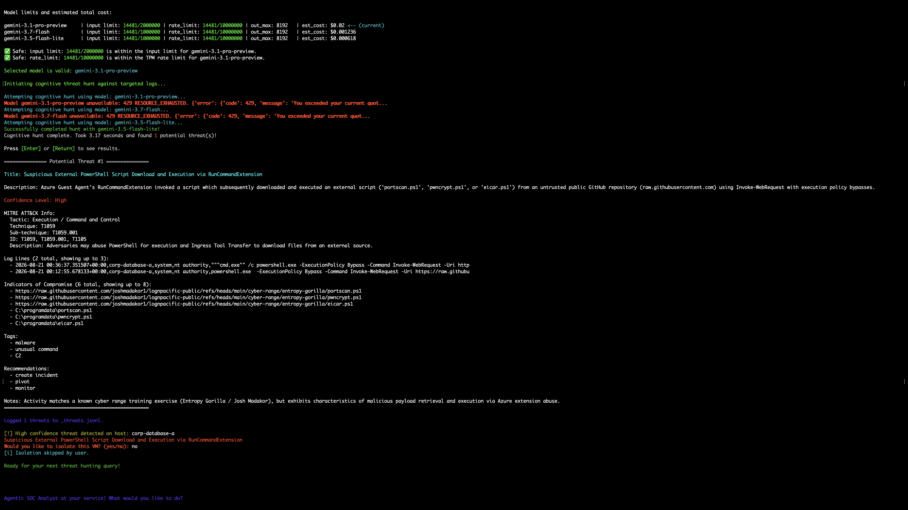

*The agent correlated a `RunCommandExtension`-spawned PowerShell chain that downloaded and executed remote scripts from an external GitHub repository, mapped it to T1059.001 and T1105, and rated it High confidence. It then stopped and asked for authorization before isolating the host. Declining returns to the prompt without touching the machine.*

---

## What it does

**Plans its own queries and shows its reasoning.** The agent selects the table, time window, and fields, then prints its rationale *before* executing anything. You see why it chose that query before a single record is read.

**Maps to ATT&CK with sub-technique precision.** In one run it correlated five failed sign-ins against a single account from Georgia, Venezuela, Iraq, and Germany, recognized error code `50053` as lockout-after-repeated-failure, identified Azure CLI as the client, and mapped it to **T1110.003 (Password Spraying)** rather than the generic parent technique.

**Grades confidence and defends the grade.** The most useful thing an analyst does is decide what *isn't* a threat. Given PowerShell running with `-ExecutionPolicy Bypass` and invoking `csc.exe` compilation, a textbook living-off-the-land pattern, the agent traced the parent process to `SenseIR.exe`, recognized Defender's own investigation tooling, rated it **Low**, and recommended `ignore`.

**Recovers from provider failure mid-hunt.** Three-model fallback chain with error classification on 429, 503, and 404. Every screenshot here shows recovery from live quota exhaustion, not a simulated failure.

**Knows what a hunt costs before spending anything.** Pre-flight sizing against each model's context window and tier rate limit, with a cost estimate. A typical hunt runs between $0.0005 and $0.02.

**Writes an audit trail.** Findings append to `_threats.jsonl`, one object per line, ready for SIEM ingestion.

---

## Safety and guardrails

Agentic systems that can act on infrastructure need constraints that don't depend on the model behaving well. These are enforced in code, not prompts:

| Control | Implementation |
|---|---|
| **Table allowlist** | The model can only reach 10 named Log Analytics tables. Anything it invents is rejected before a query is built. |
| **KQL literal sanitization** | Device names, callers, and UPNs returned by the model are treated as untrusted input. Pipes, semicolons, and newlines are stripped before reaching the query string. |
| **Result ceilings** | A hard `MAX_RECORDS` cap prevents an unscoped hunt from pulling tens of thousands of events into model context. |
| **Containment requires three conditions** | Isolation becomes available only when the query was host-scoped, **and** a finding is High confidence, **and** the analyst types `yes`. |
| **Least-privilege token acquisition** | The Defender API token is requested only inside the confirmed-isolation branch. |
| **Cost and capacity gates** | Payloads are sized against context windows and rate limits before the request is sent. |
| **Schema grounding** | Valid column names per table are supplied to the model, with instructions not to invent fields. |
| **Audit trail** | Findings persist to JSONL regardless of the analyst's decision. |

The agent **recommends**. It never unilaterally acts. Its recommendation vocabulary is a closed set (`pivot`, `create incident`, `monitor`, `ignore`), and the only destructive capability is gated behind a human keystroke.

Each supported table has its own analyst persona: `DeviceProcessEvents` examines execution chains and command lines, `DeviceNetworkEvents` looks for C2 and exfiltration, `DeviceRegistryEvents` looks for persistence and defense evasion. Prompts are assembled per-table rather than using one generic instruction.

---

## Demonstrated across four platforms

Same codebase, same live Azure environment, four operating environments, four areas of SOC work.

| Platform | Focus | Result |
|---|---|---|
| macOS Terminal | Network flow analysis | Sustained inbound scanning across SSH, Telnet, RDP, SMB, and Redis. 8 external IOCs. **T1595.001** |
| Windows PowerShell | Endpoint triage | Suspicious execution chain correctly downgraded to Low after parent-process analysis. **T1059.001** |
| Visual Studio 2026 | Identity and credential access | Repeated account lockouts from four countries against one account. **T1110.003** |
| Ubuntu 24.04 on Azure | Host-scoped hunt and containment | Remote script retrieval via `RunCommandExtension`, then human-authorized containment. **T1059.001, T1105** |

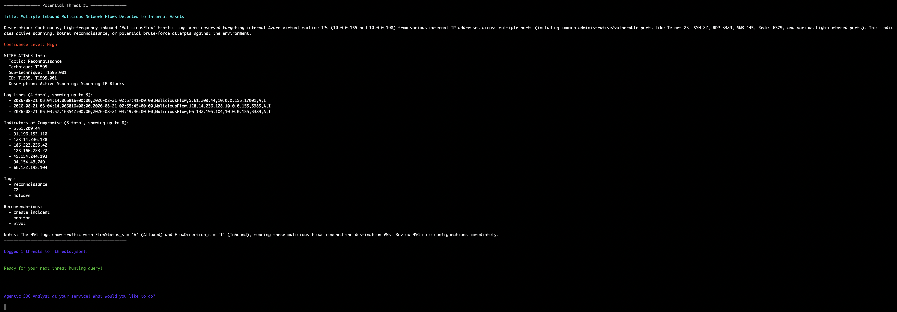
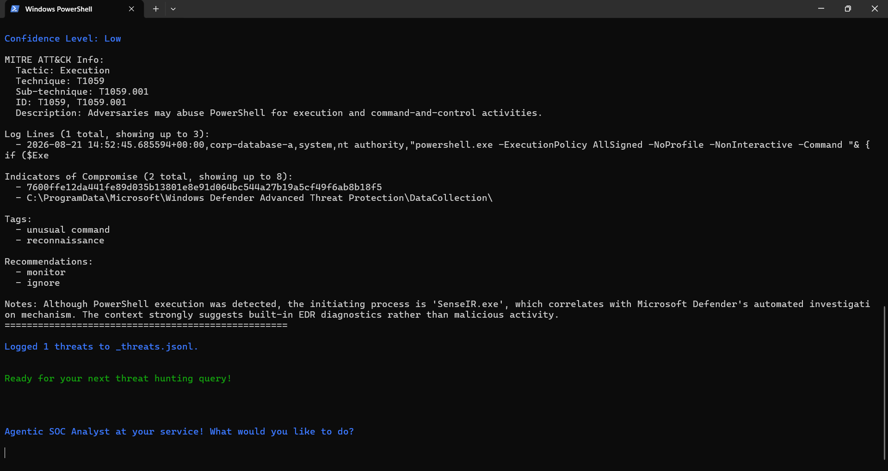
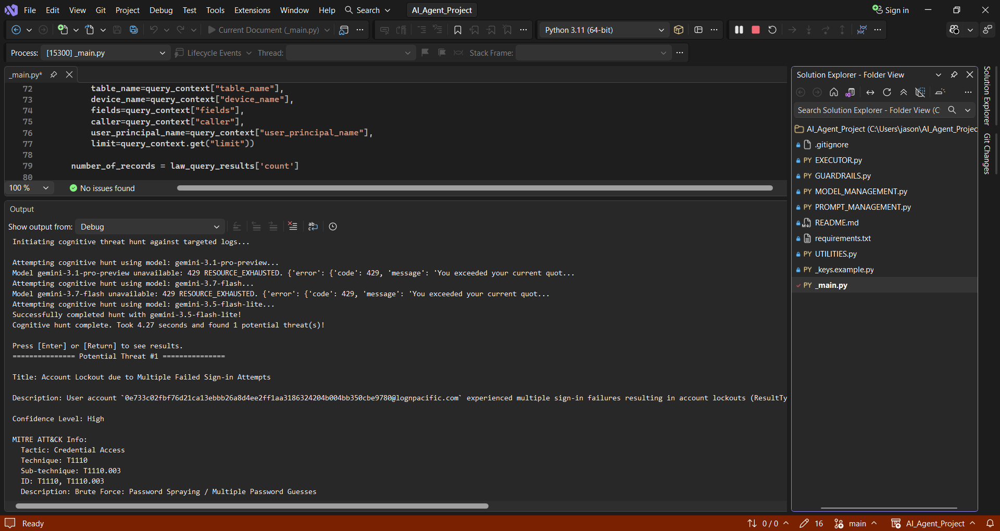

<details>
<summary>Full session output for all four platforms</summary>

**macOS Terminal**

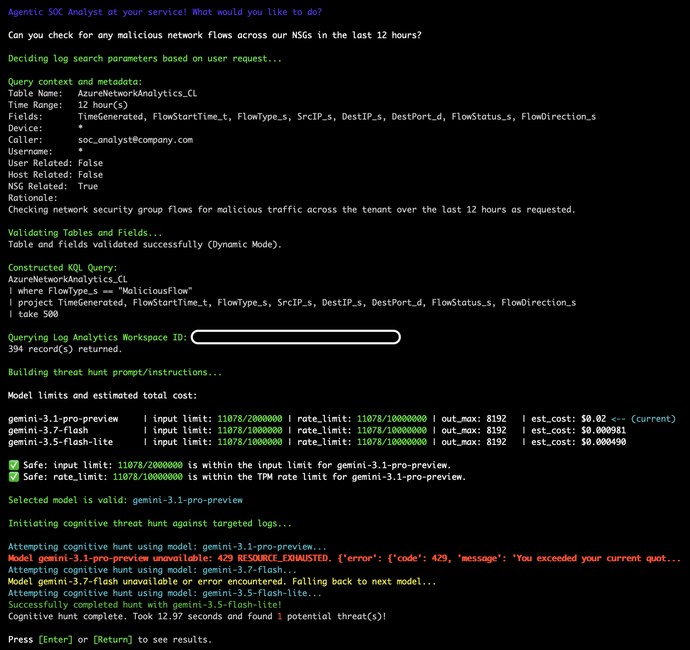

**Windows PowerShell**

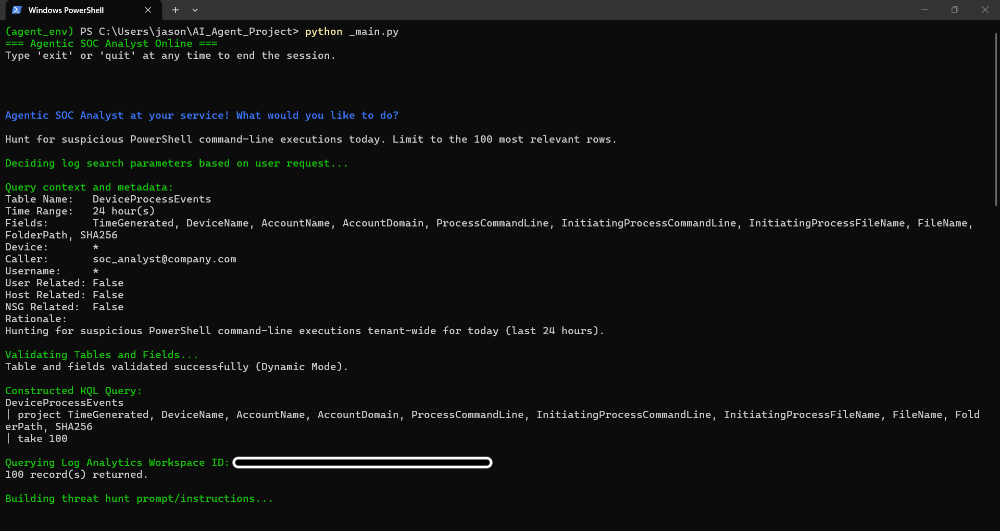
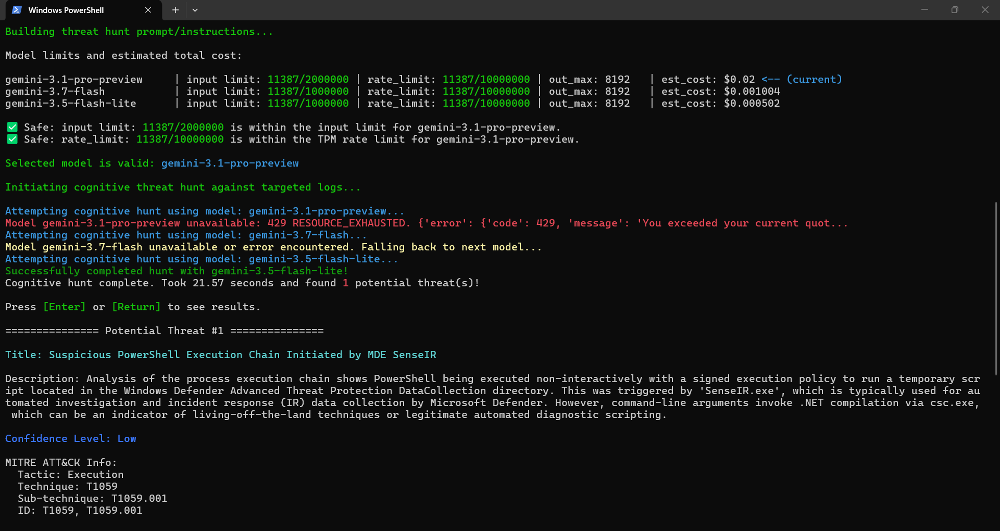

**Visual Studio 2026**

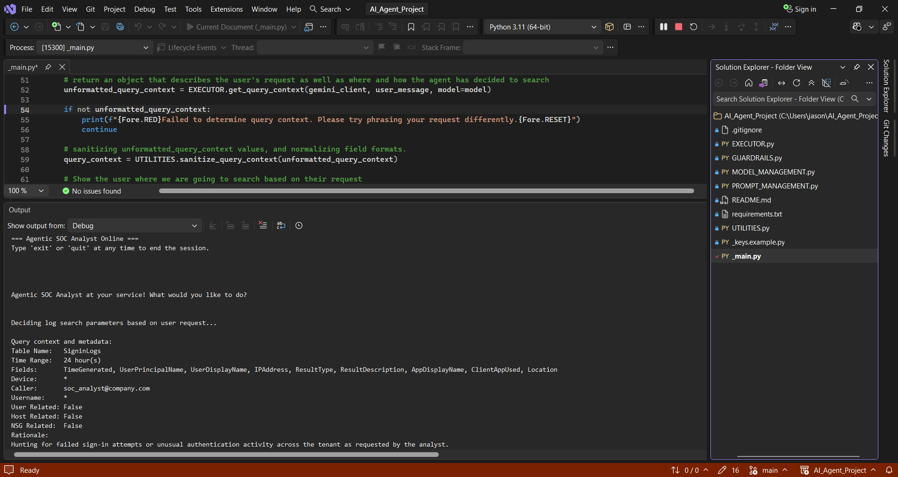
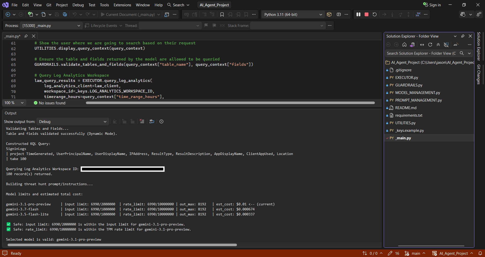
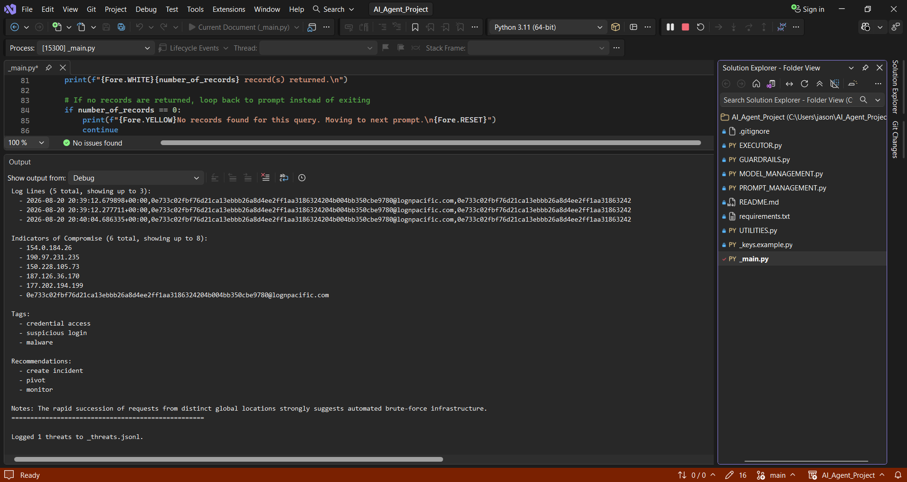

**Ubuntu 24.04 on Azure** (headless, device-code authentication)

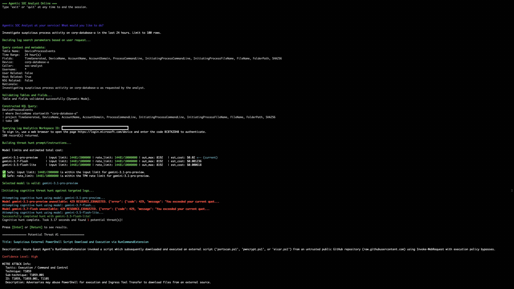

</details>

---

## Setup

Requires Python 3.11+, an Azure Log Analytics workspace with Defender or Entra ID data, a Gemini API key, and Log Analytics Reader on the target workspace. Containment additionally requires the Defender `Machine.Isolate` permission.

```bash
git clone https://github.com/jasonstokes1/agentic-ai-soc-analyst.git
cd agentic-ai-soc-analyst
python3 -m venv agent_env && source agent_env/bin/activate
pip install -r requirements.txt
cp _keys.example.py _keys.py     # then add your API key and workspace ID
python3 _main.py
```

On Windows, activate with `.\agent_env\Scripts\Activate.ps1`. `_keys.py` is gitignored and must never be committed.

Example questions:

```
Can you check for any malicious network flows across our NSGs in the last 12 hours?
Investigate suspicious process activity on corp-database-a in the last 24 hours.
Hunt for failed sign-in attempts or unusual authentication activity in the last 24 hours.
```

Tested on macOS (Python 3.14), Windows 11 via PowerShell and Visual Studio 2026 (3.11), and Ubuntu 24.04 on Azure (3.12). Desktop environments use `InteractiveBrowserCredential`; the headless VM uses `DeviceCodeCredential`.

---

## Project structure

```
_main.py                 Session loop and containment decision point
EXECUTOR.py              KQL construction, Log Analytics queries, Gemini calls,
                         model fallback chain, Defender isolation API
PROMPT_MANAGEMENT.py     Per-table analyst personas, finding schema, tool definition
GUARDRAILS.py            Table and model allowlists, tier limits, pricing data
MODEL_MANAGEMENT.py      Token estimation, capacity checks, cost projection
UTILITIES.py             Input sanitization, finding display, JSONL persistence
```

---

## Engineering notes

Failure modes specific to putting an LLM in the query-planning path, and how each was resolved:

- **Sentinel values returning zero rows silently.** Required schema fields forced the model to invent placeholders (`*`, `all`) for tenant-wide hunts. KQL `startswith` is a literal prefix match, so these matched nothing and returned no error. Fixed with a sentinel guard that omits the `where` clause.
- **Hallucinated column names.** The model requested `Account` from `DeviceProcessEvents`, which has `AccountName`. Fixed by grounding the tool-selection prompt with valid columns per table.
- **Unbounded result sets.** An unfiltered query returned 63,882 records, roughly 7.3M tokens, 3.6x the largest context window. The capacity checker flagged it and the code proceeded anyway. Fixed with a hard row cap and advisory-to-binding limit checks.
- **Invalid JSON escapes from Windows paths.** `C:\ProgramData\...` in structured output broke `json.loads()` after a hunt had already succeeded. Fixed with a repair pass for backslashes not part of a valid escape sequence.
- **Containment prompt firing per finding.** Declining isolation meant being asked again for the next high-confidence finding. Redesigned to present all findings together and request one decision, which is also better tradecraft.

**Current limitations.** KQL `take` returns an arbitrary subset rather than the most recent rows, so identical hunts can analyze different data. Findings vary between runs, since fallback models differ in sensitivity. Credential type is hardcoded per platform and should be configuration. Field names rely on Log Analytics' own schema enforcement rather than a local allowlist. Token counting uses a character heuristic rather than the SDK tokenizer, trading precision for an avoided round-trip.

---

## Scope and authorized use

Built and tested exclusively against a purpose-built cyber range: an isolated Azure environment with intentionally exposed hosts generating genuine attack telemetry from internet-wide scanning. All hostnames, accounts, and internal IPs shown here belong to that lab.

This tool queries security telemetry and can take containment action against endpoints. **Do not run it against any environment you are not explicitly authorized to assess.** The human-in-the-loop gate should not be removed.
